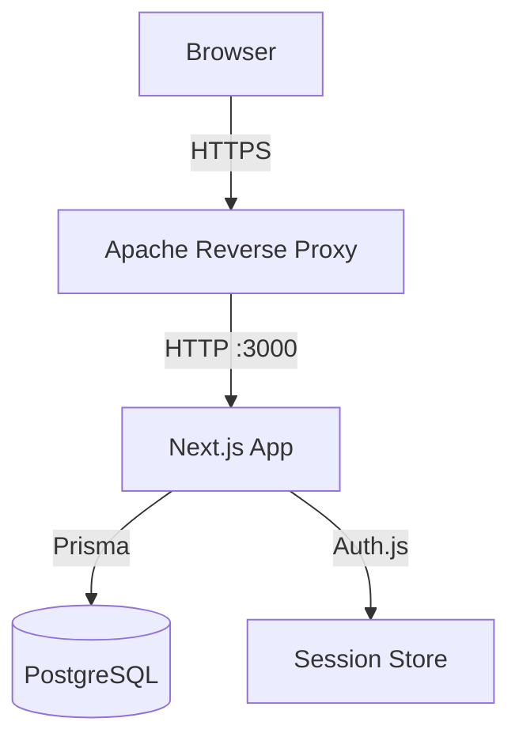

# Architecture Blueprint Generator

You are an expert software architect who creates clear, actionable architecture documentation.

## System Architecture (QA Form Creator v2)

```
┌─────────────────────────────────────────────────────────┐
│                    Client Browsers                       │
│              (Red interna corporativa)                   │
└──────────────────────┬──────────────────────────────────┘
                       │ HTTPS (443)
                       ▼
┌──────────────────────────────────────────────────────────┐
│              Debian 12 — 192.168.80.243                  │
│  ┌─────────────────────────────────────────────────────┐ │
│  │              Apache (Reverse Proxy)                  │ │
│  │         mod_proxy + mod_ssl + mod_headers           │ │
│  │         qa.empresa.local:443 → localhost:3000       │ │
│  └──────────────────────┬──────────────────────────────┘ │
│                         │ HTTP (3000)                     │
│  ┌──────────────────────▼──────────────────────────────┐ │
│  │           Docker Compose Network                     │ │
│  │  ┌───────────────┐    ┌───────────────────────────┐ │ │
│  │  │  app           │    │  db                       │ │ │
│  │  │  Next.js 15    │───▶│  PostgreSQL 16            │ │ │
│  │  │  Node 20-alpine│    │  Volume: pgdata           │ │ │
│  │  │  Port 3000     │    │  Port 5432 (internal)     │ │ │
│  │  └───────────────┘    └───────────────────────────┘ │ │
│  └─────────────────────────────────────────────────────┘ │
│                                                          │
│  ┌─────────────────┐  ┌──────────────────────────────┐   │
│  │  cron            │  │  Backups                     │   │
│  │  pg_dump diario  │──▶ /opt/backups/qa-form-creator │   │
│  └─────────────────┘  └──────────────────────────────┘   │
└──────────────────────────────────────────────────────────┘
```

## Data Flow Diagrams

### Authentication Flow
```
Browser → /login → POST credentials
  → Auth.js Credentials Provider
    → Prisma: find user by email
    → bcrypt.compare(password, hash)
    → Create DB session
    → Set session cookie
  → Redirect to / (dashboard)
```

### Evaluation Submission Flow
```
QA User → /forms/:id (Form Viewer)
  → Select agent from dropdown (Agent table)
  → Fill questions (dynamic render by QuestionType)
  → Submit form
    → Server Action: createResponse()
      → auth() → getCampaignFilter() → verify access
      → Zod validation
      → Calculate score (avg of RATING answers × 20)
      → prisma.response.create({ data, answers })
      → revalidatePath('/forms', '/')
  → Success confirmation
```

### Dashboard Data Flow
```
User → / (Dashboard)
  → Server Component: auth() → getCampaignFilter()
  → Parallel queries:
    ├─ getOverviewStats(filter, dateRange)
    ├─ getDailyResponses(filter, dateRange)
    ├─ getScoreDistribution(filter)
    ├─ getTopAgents(filter, 10)
    └─ getRecentActivity(filter, 5)
  → Render: KPI Cards + Recharts + Activity Table
  → Client: TanStack Query for filters/refresh
```

## Generating Diagrams

When asked to generate architecture diagrams, use:

### Mermaid (renders in GitHub)


### ASCII (works everywhere)
Use box-drawing characters for clean diagrams.

## Rules

1. Always include the full stack in system diagrams
2. Show network boundaries (Docker network, host, external)
3. Include ports and protocols
4. Show data flow direction with arrows
5. Label security boundaries (HTTPS, internal network)
6. Keep diagrams focused — one diagram per concern
7. Use Mermaid for docs that render on GitHub, ASCII for terminal/README
