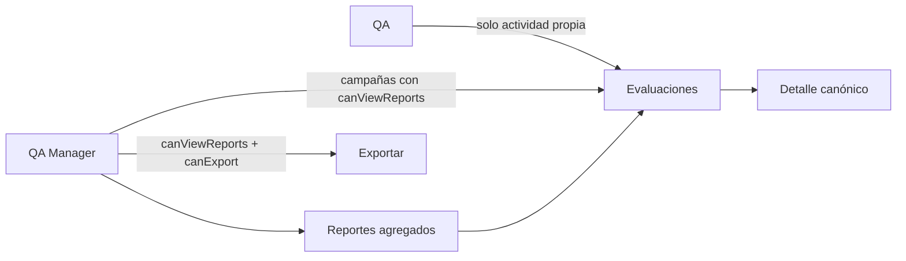

# Arquitectura de información y acceso

Última actualización: 2026-07-17

## Objetivo

Qore separa el trabajo diario, la analítica, la operación y la administración sin depender únicamente del rol mostrado en la interfaz. La visibilidad del menú orienta al usuario, pero toda lectura o mutación sensible se vuelve a autorizar en el servidor y por campaña.



## Navegación canónica

| Grupo | Módulo | Ruta | Regla de visibilidad |
|---|---|---|---|
| Principal | Dashboard | `/` | `canViewDashboard` |
| Principal | Formularios | `/forms` | `canViewForms` |
| Principal | Evaluaciones | `/evaluations` | `canViewDashboard` o `canViewReports` |
| Principal | Reportes | `/reports` | `canViewReports` |
| Analítica | KPIs | `/kpis` | `canViewKPIs` |
| Analítica | Rendimiento | `/analytics/agents` | `canViewKPIs` |
| Operación | Agentes | `/operations/agents` | `canManageAgents` |
| Operación | Equipos | `/operations/teams` | `canManageAgents` |
| Operación | Disposiciones | `/operations/dispositions` | `canManageDispositions` |
| Administración | Usuarios | `/admin/users` | `ADMIN` |
| Administración | Campañas | `/admin/campaigns` | `ADMIN` |
| Configuración | Configuración de calidad | `/settings` | usuario activo |

`Exportar` es una acción dentro de Reportes y no ocupa un enlace permanente en el sidebar.

## Contrato de Evaluaciones

`/evaluations` es la ubicación canónica para consultar evaluaciones enviadas y abrir su detalle.

### Vista «Mis evaluaciones»

- Requiere `canViewDashboard` en la campaña.
- El servidor agrega obligatoriamente `evaluatorId = session.user.id`.
- El cliente no puede solicitar el historial de otro evaluador.
- El periodo se calcula con `submittedAt`, que representa cuándo la evaluación pasó a formar parte del historial oficial.

### Vista «Equipo y campañas»

- Requiere `canViewReports` en cada campaña solicitada.
- Permite ver evaluaciones de los evaluadores dentro de ese alcance.
- No combina permisos de campañas distintas.

### Detalle

Una evaluación enviada puede abrirse si se cumple al menos una de estas condiciones:

1. Es del evaluador autenticado y pertenece a una campaña donde puede ver su trabajo.
2. Pertenece a una campaña donde tiene `canViewReports`.
3. Es un borrador dentro de una campaña donde tiene `canEditEvaluations`.
4. Está cancelada y pertenece a una campaña donde tiene `canViewAudit`.

Después de autorizar, la consulta valida también la integridad entre formulario, agente, equipo, disposición, categoría y campaña.

## Seguimiento mensual y coaching

Evaluaciones permite revisar el trabajo por `Este mes`, `Mes anterior`, rangos rápidos o un periodo personalizado. Los filtros de agente, formulario, disposición, resultado, score y fatalidad están disponibles en ambas vistas; el filtro de evaluador solo aparece en la vista administrada.

Al seleccionar un agente y un mes, el resumen muestra:

- cantidad de llamadas evaluadas;
- promedio general del agente;
- pass rate del periodo;
- score y resultado de cada evaluación individual.

Las opciones de los filtros no se obtienen de catálogos globales: se derivan únicamente de evaluaciones enviadas que el usuario ya está autorizado a consultar. Así, un QA no descubre nombres o actividad fuera de su propio alcance y un QA Manager solo ve sus campañas con `canViewReports`.

Dashboard, KPIs, Reportes, Evaluaciones y Exportar usan `submittedAt` como fecha oficial. Una llamada pertenece al periodo en que la evaluación fue enviada, no al día en que se creó su borrador. La base de datos repara registros históricos enviados sin esa fecha y aplica una restricción que impide crear nuevos estados `SUBMITTED` sin timestamp de envío.

## Reportes y exportaciones

Reportes conserva indicadores, filtros y una muestra paginada para análisis. El detalle completo se abre en `/evaluations/[responseId]`; no existe una segunda ficha con reglas diferentes.

Una exportación requiere simultáneamente:

```text
canViewReports = true
canExport      = true
misma campaña
```

Esto impide que una asignación con `canViewReports` en una campaña y `canExport` en otra se combine como si fuera autorización válida.

## Compatibilidad de enlaces

Los enlaces antiguos permanecen como redirecciones para no romper marcadores ni notificaciones históricas:

- `/analytics/responses` → `/evaluations`
- `/analytics/responses/[responseId]` → `/evaluations/[responseId]`

Las nuevas notificaciones y acciones internas ya generan enlaces canónicos.

## Menú de usuario

El header usa un único menú accesible con:

- identidad, correo y rol;
- acceso a Mi perfil;
- tema Claro, Oscuro o Sistema;
- Cerrar sesión como última acción;
- protección contra pérdida de cambios antes de navegar o cerrar sesión.

No se muestra un selector de idioma hasta que exista internacionalización real y persistencia de preferencias.

## Trabajo posterior deliberadamente separado

Estos cambios requieren su propio ciclo de diseño, migración y pruebas; no deben resolverse ocultando enlaces antes de alcanzar paridad funcional:

1. Unificar Usuarios y permisos por campaña en una sola experiencia administrativa.
2. Retirar las rutas administrativas antiguas de agentes, equipos y disposiciones después de confirmar paridad con Operación.
3. Reducir Configuración a controles realmente modificables y separar las reglas informativas.
4. Implementar preferencias persistentes de notificaciones, idioma y presentación de zona horaria.
5. Añadir metas configurables de muestra por agente y alertas de cobertura mensual.
6. Incorporar un identificador de interacción o llamada, fecha de contacto y referencia de grabación para trazabilidad más allá de `Response.id`.

## Historial y reversión segura

El estado previo a esta reorganización está preservado en:

```text
commit: 9612983
tag:    checkpoint-before-navigation-20260717
```

Para inspeccionarlo sin alterar el trabajo actual:

```powershell
git show checkpoint-before-navigation-20260717
```

Para probar el estado anterior en otra rama, sin borrar la implementación vigente:

```powershell
git switch -c codex/rollback-navigation checkpoint-before-navigation-20260717
```
