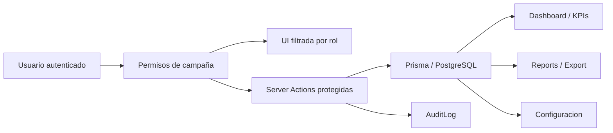

# Plan de cambios criticos: Configuracion, permisos y gobierno QA

Last updated: 2026-05-04

## Objetivo

Evolucionar Qore desde una app de evaluaciones QA con configuracion global basica hacia una plataforma de gobierno operativo por campaña, con permisos reales, scoring configurable, auditoria y una UI de Configuracion alineada al trabajo diario de QA Managers, QA de campaña y Supervisores.

Este plan prioriza seguridad y consistencia de datos antes de agregar pantallas nuevas. El panel de Configuracion debe reflejar reglas que el backend ya aplica, no promesas visuales que puedan saltarse llamando Server Actions directamente.

## Principios de trabajo

1. Todo permiso se valida en servidor.
2. Un usuario solo ve, modifica y exporta datos de campañas autorizadas.
3. Los cambios sensibles quedan auditados.
4. El scoring usado en una evaluacion debe ser trazable.
5. Los formularios publicados no deben romper historial.
6. La UI debe ser operativa, sobria y especifica para QA; no SaaS generico.
7. Infraestructura, branding, backups, deploys y logs tecnicos quedan fuera del panel de QA Manager.

## Estado actual resumido

La app ya tiene:

- Roles `ADMIN` y `QA`.
- Usuarios asignados a campañas mediante `UserCampaign`.
- Formularios con preguntas `TEXT`, `RATING`, `SELECT` y `RADIO`.
- Evaluaciones con respuestas y score.
- Campañas, agentes, equipos, disposiciones y categorias de disposicion.
- Dashboard, KPIs, reports, exportaciones y analytics.
- Configuracion actual con `Mi cuenta` y `Scoring` global.
- `AppSetting` como key/value global para `passThreshold`, `targetPassRate`, `targetAvgScore` y `targetDailyRate`.

La app todavia no tiene:

- Rol Supervisor.
- Permisos granulares por campaña.
- Auditoria operativa.
- Scoring por campaña.
- Categorias QA para preguntas/scoring.
- Pesos por pregunta o categoria.
- N/A, reglas fatales o comentarios obligatorios por regla.
- Versionado de formularios.
- Evaluaciones editables/anulables con historial.
- Notificaciones operativas.
- Exportaciones auditadas.

## Riesgos criticos que bloquean el panel avanzado

Antes de ampliar Configuracion, hay que corregir estos riesgos:

- Filtros de campaña sobrescribibles por parametros externos.
- Acciones mutantes que solo validan sesion, no permiso sobre la entidad.
- `submitResponse` sin validacion fuerte de campaña, agente, disposicion y answers.
- Exportaciones que pueden filtrar fuera del scope permitido.
- Secretos versionados en scripts.
- Deploy con Prisma CLI no fijada y fallback `db push --accept-data-loss`.
- App expuesta directamente por HTTP en `0.0.0.0:3000`.
- Cookies no seguras en produccion.

## Modelo de roles objetivo

### QA Manager

Rol global de administracion operativa.

Puede:

- Ver todas las campañas.
- Crear usuarios.
- Asignar campañas.
- Configurar permisos.
- Configurar scoring global.
- Configurar scoring por campaña.
- Administrar categorias QA.
- Ver auditoria operativa.
- Ver Dashboard, KPIs, Reports y Export globales.

No debe:

- Cambiar logo, colores o branding.
- Ver estado tecnico del servidor.
- Gestionar backups, deploys o logs tecnicos.

### QA de campaña

Usuario operativo con permisos dentro de campañas asignadas.

Puede, segun permisos:

- Ver Dashboard/KPIs de sus campañas.
- Crear, editar o publicar formularios de sus campañas.
- Evaluar agentes.
- Editar evaluaciones si se le permite.
- Administrar agentes, equipos y disposiciones de sus campañas.
- Exportar datos de sus campañas si se le permite.
- Ajustar scoring de campaña si se le permite.

No debe:

- Ver campañas no asignadas.
- Crear usuarios globales.
- Delegar permisos criticos.
- Cambiar configuracion global.

### Supervisor

Rol de lectura y coaching.

Puede, segun permisos:

- Ver Dashboard/KPIs/reportes de su campaña.
- Ver agentes, evaluaciones y tendencias.
- Consultar coaching list.

No debe:

- Crear o publicar formularios.
- Evaluar agentes.
- Cambiar scoring.
- Exportar salvo permiso especial.
- Ver campañas ajenas.

## Arquitectura funcional objetivo



## Fase 0 - Preparacion tecnica y seguridad

### Objetivo

Dejar el proyecto listo para cambios estructurales sin aumentar riesgo en produccion.

### Backend / infraestructura

- Rotar secretos expuestos en scripts.
- Reemplazar credenciales hardcodeadas por variables de entorno o llaves SSH.
- Mover helpers de deploy inseguros fuera del repo o convertirlos en plantillas sin secretos.
- Cambiar permisos de `/opt/qa-form-creator/.env.production` a `600`.
- Publicar app solo via Apache usando `127.0.0.1:3000:3000`.
- Remover `useSecureCookies: false` o hacerlo dependiente de entorno.
- Corregir deploy para usar Prisma CLI versionada.
- Eliminar fallback `prisma db push --accept-data-loss`.
- Asegurar que produccion use `prisma migrate deploy`.

### Calidad local

- Migrar `biome.json` a Biome 2.4.10.
- Separar Vitest de Playwright.
- Excluir `.claude/worktrees` de lint/test.
- Resolver build con fuente local o estrategia controlada para Montserrat.
- Migrar `middleware.ts` a `proxy.ts` por Next.js 16.

### Criterios de salida

- `pnpm lint` ejecuta sin error de configuracion.
- `pnpm build` no depende de descarga externa no controlada.
- Deploy no usa `db push --accept-data-loss`.
- App no queda expuesta por HTTP directo en la LAN.
- Secretos removidos del repo y rotados.

## Fase 1 - RBAC real y aislamiento por campaña

### Objetivo

Crear una base de permisos confiable antes de agregar Configuracion avanzada.

### Schema propuesto

Agregar permisos granulares por campaña:

```prisma
enum Role {
  ADMIN
  QA
  SUPERVISOR
}

enum CampaignPermission {
  VIEW_DASHBOARD
  VIEW_KPIS
  VIEW_FORMS
  CREATE_FORMS
  EDIT_FORMS
  PUBLISH_FORMS
  EVALUATE_AGENTS
  EDIT_EVALUATIONS
  VIEW_REPORTS
  EXPORT_REPORTS
  MANAGE_AGENTS
  MANAGE_TEAMS
  MANAGE_DISPOSITIONS
  MANAGE_CAMPAIGN_SCORING
  VIEW_AUDIT
}

model UserCampaignPermission {
  userId     String
  campaignId String
  permission CampaignPermission
  grantedAt  DateTime @default(now())
  grantedBy  String?

  user     User     @relation(fields: [userId], references: [id], onDelete: Cascade)
  campaign Campaign @relation(fields: [campaignId], references: [id], onDelete: Cascade)

  @@id([userId, campaignId, permission])
  @@index([campaignId, permission])
}
```

### Backend

Crear helpers centrales:

- `requireSession()`
- `requireAdmin()`
- `getUserCampaignIds()`
- `assertCampaignAccess(campaignId)`
- `assertCampaignPermission(campaignId, permission)`
- `buildCampaignScopedWhere(session, requestedCampaignId?)`
- `assertAgentAccess(agentId, permission?)`
- `assertTeamAccess(teamId, permission?)`
- `assertFormAccess(formId, permission?)`
- `assertResponseAccess(responseId, permission?)`
- `assertDispositionAccess(dispositionId, permission?)`

Refactorizar acciones:

- `agents.ts`
- `teams.ts`
- `forms.ts`
- `responses.ts`
- `exports.ts`
- `dispositions.ts`
- `campaigns.ts`
- `analytics.ts`

### UI

- Mostrar/ocultar botones por permiso, no solo por rol.
- Mantener bloqueo servidor aunque la UI oculte opciones.
- En Sidebar, mostrar modulos segun permisos:
  - Dashboard
  - Formularios
  - Reports
  - KPIs
  - Agentes
  - Exportar
  - Configuracion
  - Admin

### Criterios de salida

- QA no puede consultar campaña ajena aunque envie `campaignId` manual.
- QA no puede mutar agentes/equipos/formularios fuera de su permiso.
- Export solo devuelve datos visibles para el usuario.
- Tests cubren casos de campaña asignada/no asignada.

## Fase 2 - Auditoria operativa base

### Objetivo

Registrar acciones sensibles antes de habilitar configuraciones con impacto operacional.

### Schema propuesto

```prisma
enum AuditAction {
  USER_CREATED
  USER_UPDATED
  CAMPAIGN_ACCESS_UPDATED
  PERMISSION_GRANTED
  PERMISSION_REVOKED
  FORM_CREATED
  FORM_UPDATED
  FORM_PUBLISHED
  RESPONSE_CREATED
  RESPONSE_UPDATED
  RESPONSE_VOIDED
  GLOBAL_SCORING_UPDATED
  CAMPAIGN_SCORING_UPDATED
  EXPORT_CREATED
  AGENT_UPDATED
  TEAM_UPDATED
  DISPOSITION_UPDATED
}

model AuditLog {
  id          String      @id @default(cuid())
  action      AuditAction
  actorId     String?
  campaignId  String?
  entityType  String?
  entityId    String?
  before      Json?
  after       Json?
  metadata    Json?
  createdAt   DateTime    @default(now())

  @@index([campaignId, createdAt])
  @@index([actorId, createdAt])
  @@index([action, createdAt])
}
```

### Backend

- Crear `recordAuditEvent()`.
- Auditar:
  - cambios de usuario/campaña/permisos,
  - cambios de scoring,
  - publicacion/edicion de formularios,
  - creacion/edicion/anulacion de evaluaciones,
  - exportaciones,
  - cambios en agentes/equipos/disposiciones.

### UI

Crear en Configuracion:

- Tab `Auditoria operativa`.
- Filtros por usuario, campaña, modulo, accion y fecha.
- Tabla con evento resumido.
- Drawer/modal de detalle con `antes`, `despues`, actor e impacto.

### Criterios de salida

- Cada accion critica deja registro.
- QA Manager ve auditoria global.
- QA de campaña solo ve auditoria de sus campañas si tiene permiso.
- Supervisor no ve auditoria por defecto.

## Fase 3 - Configuracion: Mi cuenta y Accesos

### Objetivo

Transformar Configuracion en centro operativo sin duplicar administracion innecesaria.

### Mi cuenta

Mantener y ampliar:

- Nombre.
- Email.
- Rol.
- Campañas asignadas.
- Idioma.
- Zona horaria.
- Tema claro/oscuro.
- Cambio de contraseña.

No incluir permisos editables en esta seccion.

### Accesos y permisos

Crear una UI tipo matriz:

- Busqueda de usuario.
- Filtro por campaña.
- Filtro por rol.
- Tabla de usuarios, rol, campañas y nivel.
- Detalle de usuario con:
  - campañas asignadas,
  - permisos por campaña,
  - permisos criticos resaltados,
  - auditoria reciente del usuario.

### Backend

- Server Actions para leer y actualizar permisos.
- Validacion exclusiva de QA Manager para:
  - crear usuarios,
  - asignar campañas,
  - otorgar permisos criticos,
  - quitar acceso.

### Criterios de salida

- QA Manager puede administrar permisos por campaña.
- QA de campaña no puede delegar permisos.
- Todos los cambios quedan auditados.

## Fase 4 - Scoring global y scoring por campaña

### Objetivo

Permitir defaults globales y overrides por campaña.

### Schema propuesto

```prisma
model CampaignSetting {
  campaignId      String @id
  useCustomValues Boolean @default(false)
  passThreshold   Int?
  targetPassRate  Int?
  targetAvgScore  Int?
  targetDailyRate Int?
  scoringMethod   String?
  naHandling      String?
  roundingMode    String?
  updatedAt       DateTime @updatedAt
  updatedBy       String?

  campaign Campaign @relation(fields: [campaignId], references: [id], onDelete: Cascade)
}
```

### Scoring global

Configurar:

- Pass Threshold global.
- Target Score global.
- Target Pass Rate global.
- Target evaluaciones diarias global.
- Metodo de calculo.
- Manejo de N/A.
- Redondeo.

### Scoring por campaña

Configurar:

- Override global.
- Pass Threshold.
- Target Score.
- Target Pass Rate.
- Evaluaciones diarias objetivo.
- Fallas fatales permitidas.

### Backend

- `getEffectiveSettings(campaignId)`.
- Dashboard, KPIs, reports y analytics deben usar settings efectivos.
- No recalcular evaluaciones historicas automaticamente.

### UI

- Tabs: `Scoring global` y `Scoring por campaña`.
- Banner claro: "Aplica a reportes y evaluaciones futuras; no recalcula historico".
- Selector de campaña.
- Indicador de valores heredados vs personalizados.

### Criterios de salida

- Dashboard y KPIs usan thresholds por campaña cuando existan.
- Cambios quedan auditados.
- QA de campaña solo puede cambiar scoring si tiene permiso.

## Fase 5 - Categorias QA y formularios profesionales

### Objetivo

Separar categorias de disposicion de categorias QA usadas para scoring.

### Schema propuesto

```prisma
model QaCategory {
  id                    String   @id @default(cuid())
  name                  String
  description           String?
  active                Boolean  @default(true)
  fatalAllowed          Boolean  @default(false)
  commentRequired       Boolean  @default(false)
  visibleInDashboard    Boolean  @default(true)
  visibleInKpis         Boolean  @default(true)
  createdAt             DateTime @default(now())
  updatedAt             DateTime @updatedAt

  @@unique([name])
}
```

Extender preguntas:

- `qaCategoryId`
- `weight`
- `fatal`
- `allowNa`
- `requiresCommentOnFail`

### Formularios

Agregar estados y versionado:

- Draft.
- Published.
- Archived.
- Version.
- Parent/origin form.
- Publicar crea snapshot estable.
- Editar formulario publicado crea nueva version.

### UI

En Configuracion:

- `Categorias QA`: solo QA Manager crea/edita/desactiva.
- `Formularios`: defaults globales y reglas de publicacion.

En modulo Formularios:

- Asignar categoria QA por pregunta.
- Definir peso.
- Marcar fatal.
- Permitir N/A.
- Preview de score.
- Validacion de pesos antes de publicar.

### Criterios de salida

- Preguntas tienen categoria QA.
- Formularios publicados no rompen evaluaciones historicas.
- Pesos se validan antes de publicar.

## Fase 6 - Evaluaciones avanzadas

### Objetivo

Hacer que las evaluaciones sean auditables, editables bajo regla y compatibles con scoring avanzado.

### Schema sugerido

Extender `Response`:

- `status`: draft/submitted/voided.
- `generalNote`.
- `scoreSnapshot`.
- `settingsSnapshot`.
- `submittedAt`.
- `updatedAt`.
- `voidedAt`.
- `voidedBy`.
- `voidReason`.

Extender `Answer`:

- `isNa`.
- `comment`.
- `scoreValue`.
- `failedFatal`.

### Backend

- Validar required.
- Validar rango rating.
- Validar opciones select/radio.
- Validar preguntas pertenecen al formulario.
- Validar agente/disposicion pertenecen a la campaña del formulario.
- Calcular score con settings efectivos.
- Guardar snapshot de scoring.
- Auditar cambios.

### UI

En Configuracion:

- `Evaluaciones`: reglas globales y por campaña.

En formulario de evaluacion:

- Guardar borrador.
- Autosave si se implementa.
- Resumen antes de enviar.
- Comentarios obligatorios segun regla.
- Warning si hay falla fatal.

### Criterios de salida

- No se aceptan evaluaciones inconsistentes.
- Ediciones quedan auditadas.
- Score historico es trazable.

## Fase 7 - Dashboard, KPIs, Reports y Exportacion gobernados

### Objetivo

Hacer que la configuracion afecte la lectura operacional sin fugas de datos.

### Dashboard

Debe responder: "Como va mi operacion?"

Configurable por rol:

- QA Manager: global y comparativo.
- QA campaña: solo campañas asignadas.
- Supervisor: lectura de campaña y coaching.

Widgets:

- Score promedio.
- Pass Rate.
- Total evaluaciones.
- Tendencia de score.
- Pass/Fail.
- Top performers.
- Bottom coaching.
- Categorias criticas.
- Evaluaciones recientes.

### KPIs

Debe responder: "Por que va asi?"

Widgets:

- Score por campaña.
- Score por categoria.
- Fallas fatales.
- Score por pregunta.
- Actividad de evaluadores.
- Tendencias por categoria.
- Comparativos permitidos.

### Reports y Exportacion

Reglas:

- Un usuario solo exporta lo que puede ver.
- Exportar requiere permiso.
- Cada export queda auditado.

Campos configurables:

- Fecha.
- Campaña.
- Agente.
- Evaluador.
- Formulario.
- Categoria.
- Pregunta.
- Score.
- Resultado.
- Disposicion.
- Comentarios.
- Fallas fatales.

### Criterios de salida

- No hay widgets que revelen campañas ajenas.
- Exports estan auditados.
- Reports usan settings efectivos.

## Fase 8 - Notificaciones operativas

### Objetivo

Agregar alertas de QA, no alertas tecnicas.

### Eventos utiles

- Customer Critical fallido.
- Compliance Critical fallido.
- Agente debajo del threshold.
- Campaña debajo del target.
- QA debajo de meta diaria.
- Formulario sin evaluaciones recientes.
- Evaluacion fallida enviada.
- Categoria critica en riesgo.

### UI

En Configuracion:

- Matriz por alerta y destinatario:
  - QA Manager.
  - QA campaña.
  - Supervisor.

### Backend

- Modelo de preferencias.
- Generador de eventos.
- Canal inicial recomendado: notificaciones in-app.
- Email queda para fase posterior.

### Criterios de salida

- Alertas respetan campaña y rol.
- No hay notificaciones tecnicas visibles para QA Manager.

## Menu final de Configuracion

```text
Configuracion
├── Mi cuenta
├── Accesos y permisos
├── Scoring global
├── Scoring por campaña
├── Categorias QA
├── Evaluaciones
├── Formularios
├── Dashboard & KPIs
├── Reportes & Exportacion
├── Notificaciones
└── Auditoria operativa
```

## Modulos que deben revisarse antes de liberar Configuracion avanzada

### Dashboard

- Usar settings efectivos por campaña.
- Respetar permisos por widget.
- Evitar comparativos no permitidos.

### KPIs

- Soportar categorias QA.
- Soportar fallas fatales.
- Soportar score por pregunta/categoria.
- Respetar permisos por campaña.

### Reports

- Usar filtros scoped.
- Evitar filtrar fuera de campaña asignada.
- Prepararse para campos configurables.

### Exportar

- Validar permiso `EXPORT_REPORTS`.
- Auditar cada export.
- Aplicar seleccion de campos permitidos.

### Formularios

- Agregar estado, version y publicacion.
- Agregar categoria/peso/fatal por pregunta.
- Bloquear edicion destructiva de formularios publicados.

### Evaluaciones

- Validar consistencia de campaña.
- Validar answers.
- Guardar snapshots.
- Agregar status y edicion controlada.

### Admin Usuarios

- Integrarse con Accesos y permisos.
- Evitar que un usuario se quite acceso critico accidentalmente.
- Auditar cambios.

### Admin Campañas

- Mostrar resumen de settings/permisos.
- Integrar scoring por campaña.
- Auditar cambios.

### Admin Agentes / Equipos / Disposiciones

- Validar permisos por campaña.
- Auditar cambios.
- Evitar acceso cruzado.

### Configuracion actual

- Mantener Mi cuenta.
- Dividir Scoring en global y campaña.
- Agregar tabs gradualmente segun fases.

## Orden recomendado de implementacion

1. Seguridad y tooling.
2. RBAC helpers.
3. Refactor de acciones y queries.
4. Tests de permisos.
5. Auditoria base.
6. UI de Accesos y permisos.
7. Scoring por campaña.
8. Categorias QA.
9. Versionado de formularios.
10. Evaluaciones avanzadas.
11. Dashboard/KPIs configurables.
12. Exportaciones auditadas.
13. Notificaciones.

## Estrategia de pruebas

### Unitarias

- Helpers RBAC.
- Calculo de score.
- Validacion de settings.
- Validacion de evaluaciones.

### Integracion

- Server Actions con usuarios por rol.
- Campaña asignada vs no asignada.
- Exportacion permitida vs bloqueada.
- Cambios auditados.

### E2E

- QA Manager configura permisos.
- QA de campaña crea formulario solo en su campaña.
- Supervisor ve dashboard sin botones de mutacion.
- Usuario no autorizado no puede abrir rutas ni ejecutar acciones.

## Criterios generales de aceptacion

- Ningun modulo depende solo de ocultar UI para seguridad.
- Cada cambio sensible genera auditoria.
- Todas las queries con datos de campaña usan scope efectivo.
- La configuracion global y por campaña tiene fallback claro.
- Las evaluaciones historicas siguen siendo interpretables.
- El panel no incluye branding, servidores, backups, deploys ni logs tecnicos.

## Fuera de alcance para QA Manager

Estos elementos no deben entrar al panel de Configuracion operacional:

- Logo.
- Paleta de colores.
- Branding visual.
- Estado de base de datos.
- Backups.
- Deploys.
- Jobs tecnicos.
- Logs de servidor.
- Version tecnica.
- IP avanzada.

## Resultado esperado

Al finalizar, Qore tendra un modulo de Configuracion serio y especifico para QA, capaz de gobernar permisos, scoring, formularios, evaluaciones, reportes y auditoria por campaña sin exponer detalles tecnicos ni comprometer aislamiento de datos.
